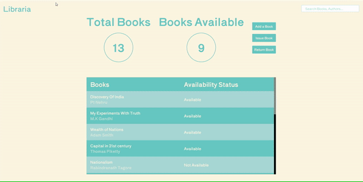

# Library-Management-System

Library Management system with functionalities to add, issue and return books

## Demo

## Features 

- Add books to the library
- Issue books and return books
- Checks availability of books if issued
- stores data of users, books issued and returned

## Languages and tools used

- HTML/ CSS/ Javascript
- VSCode
